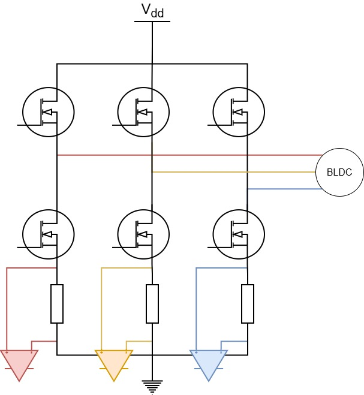
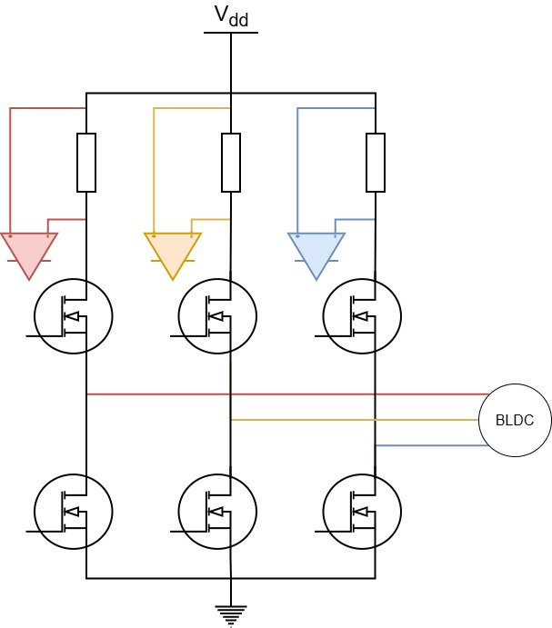
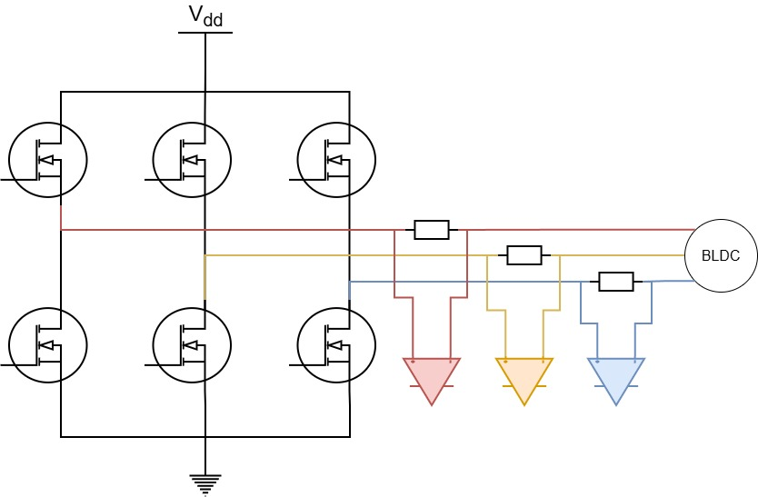
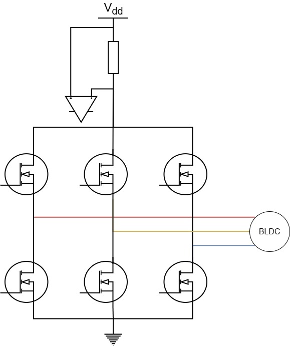
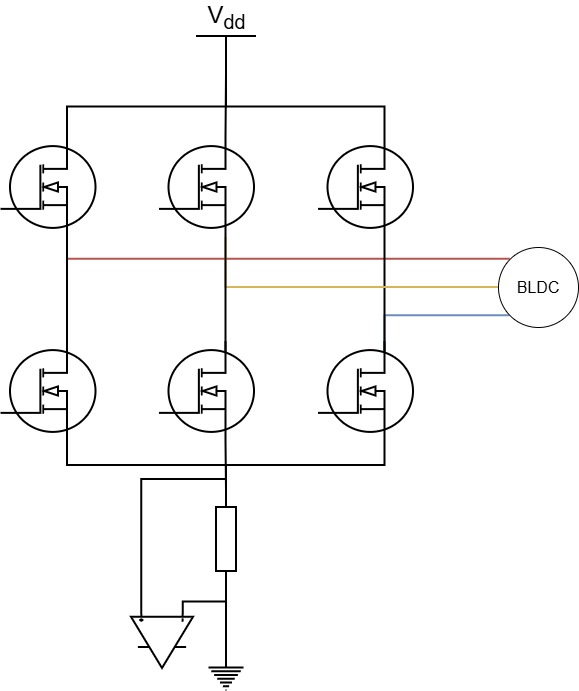

# 1 目录
+ 低侧采样
+ 高侧采样
+ 相线串联采样
+ 高/低侧单电阻
 
+ 参考链接：[【SimpleFOC】电流采样基础知识 - FBshark - 博客园](https://www.cnblogs.com/FBsharl/p/19115974)
 

# 2 采样方式详细说明
## 2.1 低侧采样说明

+ **LowSideCurrentSense**
+ **可能是最常见的电流检测技术**
+ 优点
    + 对运放的要求会比较低
        + 比如不需要运放支持很高的电压，因为低侧的电压不高
        + 比如对运放共模抑制比的要求可以弱一点
+ 缺单
    + 需求期间采不到
    + 地线耦合噪声
 

## 2.2 高侧采样说明

+ **HighSideCurrentSense**
+ **可能是最不常见的电流检测技术**
+ 优点
    + 可检测短路到地的故障
    + 不受地线噪声影响
+ 缺点
    + 运放支持的电压需要比较高
        + 具体多高取决于母线电压
    + 需要运放有较好的共模抑制比
        + 否则共模泄露会严重影响电流采样
 

## 2.3 **相线串联采样**

+ **InlineCurrentSense**
+ **实时性能最好**
+ 优点
    + 直接测相电流，不存在盲区
        + 不需要像高侧或者低侧那样，卡在在桥臂导通的时机去采集
+ 缺点
    + 相线上一直有电流，增加功耗，对采样电阻的要求提高
    + 有布局上的要求，否则相电流不平衡（这个没有很懂，回头再细究）
    + Inline 电阻增加相线电感，高速开关时振铃更大（不是很懂）
 

## 2.4 单电阻母线采样
### 2.4.1 单电阻母线高侧采样

 

### 2.4.2 单电阻母线低侧采样

 

# 3 注意点
## 3.1 高侧、低侧、单电阻采样共通点
+ 必须在桥臂MOS打开时检测电流
    + 也就是：必须在电流流过采样电阻时去采样
+ 需要避开开关噪声，在MOS开关切换之后的稳定区去采样
    + MOS切换时会有振铃之类的干扰信号
+ 运放需要能够快速响应电流变化
    + PWM频率通常为20k～50khz
    + 运放需要在电流导通时，快速简历，稳定输出采样值
+ 可以考虑使用支持硬件触发采样的MCU
+ 将ADC设置成用timer触发，到达合适时机后进行采样
 

# 4 BLDC推荐：单电阻母线低侧采样
+ 对于相线，BLDC只需要检测过零点即可，不需要关注相线上的电流具体是多少
+ 在低侧采母线电流，可以降低对运放性能的要求，降低成本
